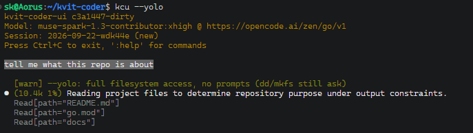

# kvit-coder

[](https://github.com/kvit-s/kvit-coder/actions/workflows/test.yml)
[](https://github.com/kvit-s/kvit-coder/releases/latest)

A coding agent in Go. Two binaries: `kvit-coder` runs one turn (user question -> multiple steps calling tools -> model's answer) and exits. And `kvit-coder-ui` - the interactive terminal front end.

The agent started as experiment to see how much coding can be done with locally ran weak models
and was extended with features more suitable to strong models. Weak/strong modes change how tools behave
and how much handholding is done. Each model added to the agent flagged as weak or strong.

It uses small amound of RAM (<30 Mb) compared to hundreds Mbs other agents use. See [`docs/agents-ram.md`](docs/agents-ram.md).
This was is important to me as I often have dosens of agents opened/running/waiting at any moment.



## Install

```bash
curl -fsSL https://raw.githubusercontent.com/kvit-s/kvit-coder/main/install.sh | sh
```

To build from source, see [`CONTRIBUTING.md`](CONTRIBUTING.md).

**Platforms.** Linux is where this is developed and used daily, including under
Windows Subsystem for Linux (WSL). The macOS builds compile and are published,
but never tested. Windows is not supported yet.

## Configure

Copy [`config.example.yaml`](config.example.yaml) to
`~/.kvit-coder/config.yaml` and point the `llm:` block at an endpoint you have —
a local llama.cpp, vLLM or Ollama server, or any hosted API that speaks the same
protocol:

Without `-config`, both binaries take the first of `$KVIT_CODER_CONFIG`,
`./config.yaml`, `~/.kvit-coder/config.yaml`, and `config.yaml` beside the
binary with symlinks resolved.

Every key is documented in
[`docs/configuration.md`](docs/configuration.md), including the parts
`config.example.yaml` leaves out: defining more than one model and switching
between them, Model Context Protocol (MCP) servers that provide external tools,
tool groups that hide tools until the model asks for them, checkpoints that
record file versions per turn, and the path and shell safety rules.

## Run

```bash
# Interactive. The directory it starts in is the workspace.
kcu

# One turn, headless. This is what you script against.
kvit-coder -p "Find all TODO comments in the codebase"

# Only the final answer on stdout.
kvit-coder -pq "What does main.go do?"
```

A turn that fails exits non-zero and says why. On a terminal the final answer is
rendered as styled markdown; piped output, `--json`, `NO_COLOR` and `TERM=dumb`
stay raw. Every flag is in [`docs/cli.md`](docs/cli.md).

## Running commands on your machine

This program executes shell commands and edits files. `workspace.path_safety_mode`
decides what happens when a path outside the workspace directory is read or
written: `allow`, `block`, `warn`, `ask_once` or `ask_always`, where the asking
modes prompt on `/dev/tty` and remember the answer for the run. Shell commands
are parsed into a syntax tree and each simple command in the line is checked on
its own against the built-in rules and the allow and deny lists in
`tools.shell`. A refused command comes back to the model as a tool result saying
what it would have done, so the turn can continue with something else. `--yolo`
disables these prompts for a run.

## Benchmarks

The harness includes three benchmarks. These are designed to check basic agentic
skills of weak models. See [`benchmarks/README.md`](benchmarks/README.md).

## Documents

[`docs/`](docs/) holds the reference documentation: the
[tools the model can call](docs/tools.md), every
[command-line flag](docs/cli.md), every [configuration key](docs/configuration.md),
[sessions and steering](docs/sessions.md), [external tools](docs/mcp.md), the
[memory measurements](docs/agents-ram.md) quoted above, and
[how the program is built](docs/architecture.md): one process per turn, sessions
as directories, and the other design decisions behind it.

## License

MIT
